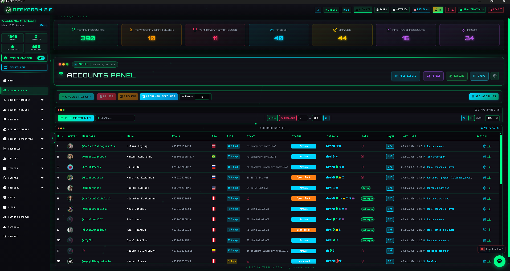
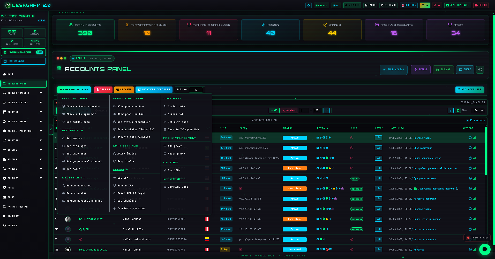
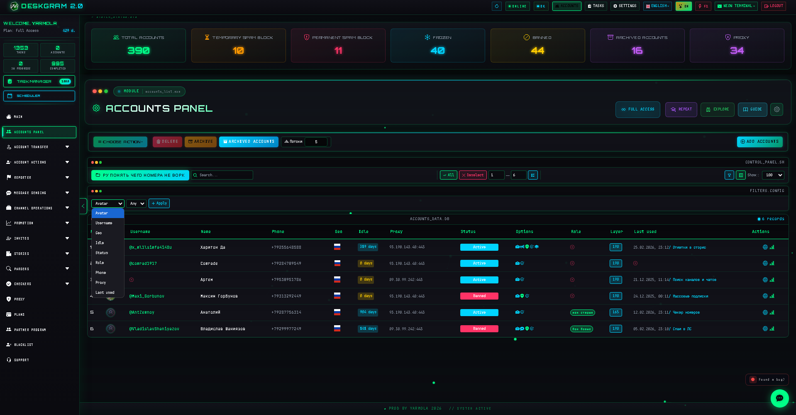

# Telegram Account Manager with Deskgram 2

Account Manager is the Deskgram 2 workspace for adding, organizing, filtering, and controlling Telegram accounts. It is the infrastructure layer that helps keep account grids usable before you move into invite, messaging, parsing, or AI-driven scenarios.

[Deskgram 2 Hub](https://github.com/Deskgram-2/deskgram-2-telegram-automation-en) | [Website](https://deskgram2.com/) | [Telegram Bot](https://t.me/DG2welcomebot) | [Web Preview](https://deskgram2.com/web-preview?path=%2Fapp-demo%2F&lang=en)
## Interactive Web Preview

Try the module interface in the browser: [Open web preview](https://deskgram2.com/web-preview?path=%2Fapp-demo%2Faccounts&lang=en)

## About the section

| Parameter | What is inside |
|---|---|
| Main task | Add, group, filter, and manage Telegram accounts |
| Useful for | Building a clean account workspace before launching modules |
| Core actions | Search, folders, tags, status review, bulk operations |
| Related sections | Proxy Manager, Invite Tool, Settings |
| Best use case | Teams or operators who work with many Telegram accounts |

## What it can do

- show a central table of Telegram accounts;
- filter accounts by folder, state, and search conditions;
- keep the workspace structured for multiple workflows;
- support bulk actions on selected accounts;
- make account preparation easier before other modules start.

## Quick start

1. Add or load accounts into the workspace.
2. Group them with folders or other internal structure.
3. Apply filters to review the needed subset.
4. Use the prepared account grid in invite, messaging, or parsing workflows.

## Where these prepared accounts usually go next

- [Join Groups](https://github.com/Deskgram-2/telegram-join-groups-deskgram-en), if account participation in communities comes first;
- [Audience Parser](https://github.com/Deskgram-2/telegram-audience-parser-deskgram-en), if the next step is building a usable user base;
- [Direct Messaging](https://github.com/Deskgram-2/telegram-direct-messaging-deskgram-en), if the accounts are being prepared for outreach;
- [Invite Tool](https://github.com/Deskgram-2/telegram-invite-tool-deskgram-en), if the audience base is ready and growth is the goal;
- [Neuro Commenting](https://github.com/Deskgram-2/telegram-neuro-commenting-deskgram-en), if the accounts are moving into AI-assisted activity.

## Interface highlight

### Main account table

### Account actions

### Filters

## When it is especially useful

- when many Telegram accounts are handled in one workspace;
- when operators need visible grouping and filtering;
- when account preparation should happen before launching scenarios;
- when the rest of the automation stack depends on a clean account base.

## Why it is more convenient than manual account handling

| Manual approach | Account Manager in Deskgram 2 |
|---|---|
| Accounts are scattered across notes and sessions | There is one visible workspace table |
| Filtering takes extra effort | Search and filtering are built in |
| Bulk maintenance is inconsistent | Selected accounts can be managed together |
| It is hard to keep infrastructure tidy | The panel acts as a stable control layer |
| Other modules start from a messy base | The workspace is prepared before execution |

## Use cases

- preparing separate account segments for [Direct Messaging](https://github.com/Deskgram-2/telegram-direct-messaging-deskgram-en), [Invite Tool](https://github.com/Deskgram-2/telegram-invite-tool-deskgram-en), and [Neuro Commenting](https://github.com/Deskgram-2/telegram-neuro-commenting-deskgram-en);
- splitting active and reserve grids before large campaigns;
- preparing the account layer before [Proxy Manager](https://github.com/Deskgram-2/telegram-proxy-manager-deskgram-en), settings work, or execution modules;
- organizing accounts by folders, teams, or use case when several Deskgram 2 workflows run side by side.

## What to choose: Account Manager or Task Manager

| If your goal is | Better fit |
|---|---|
| Prepare and structure the account base | `Account Manager` |
| Watch running processes and execution states | [Task Manager](https://github.com/Deskgram-2/telegram-task-manager-deskgram-en) |
| Build a subset of accounts for a specific launch | `Account Manager` |
| Monitor live errors, progress, and completed runs | [Task Manager](https://github.com/Deskgram-2/telegram-task-manager-deskgram-en) |

## Related repositories

- [Deskgram 2 Hub](https://github.com/Deskgram-2/deskgram-2-telegram-automation-en)
- [Proxy Manager](https://github.com/Deskgram-2/telegram-proxy-manager-deskgram-en)
- [Invite Tool](https://github.com/Deskgram-2/telegram-invite-tool-deskgram-en)
- [Automation Settings](https://github.com/Deskgram-2/telegram-automation-settings-deskgram-en)
- [Audience Parser](https://github.com/Deskgram-2/telegram-audience-parser-deskgram-en)
- [Direct Messaging](https://github.com/Deskgram-2/telegram-direct-messaging-deskgram-en)
- [Neuro Commenting](https://github.com/Deskgram-2/telegram-neuro-commenting-deskgram-en)

## FAQ

### Is this only for large account grids?

No. It becomes especially useful at scale, but the same structure helps smaller workspaces stay organized.

### Why is it important before running modules?

Because clean account preparation reduces chaos in downstream workflows.

